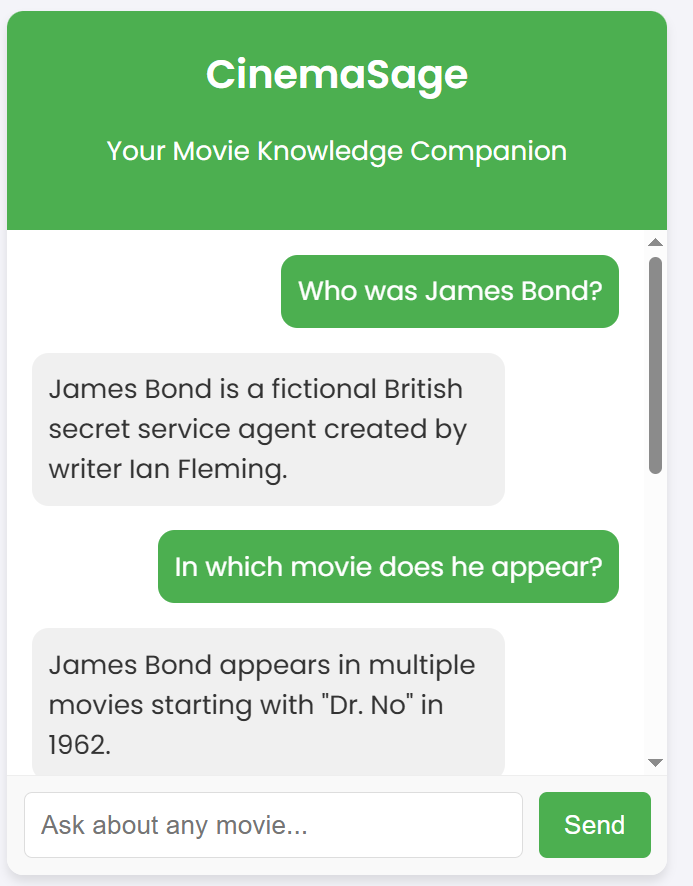

# CinemaSage
CinemaSage is an NLP-based question-answering system designed to retrieve movie-related information from the CMU Movie Summary Corpus. It leverages Large Language Models (LLMs) like Llama 2 and OpenAI to provide detailed answers about movie plots, characters, genres, and actors.
# Introduction
CinemaSage is a question-answering system designed to help users quickly explore movie details, such as plots, characters, and genres, by leveraging the CMU Movie Summary Corpus. The system uses advanced NLP techniques and Large Language Models (LLMs) to provide accurate answers to movie-related queries.
# Problem Statement
Searching through vast movie summaries manually is inefficient. CinemaSage automates this process, enabling users to find movie details quickly and easily.
# Objective
1) Deliver accurate answers to user queries about movies.
2) Use NLP techniques to provide detailed and relevant information.
# Methodology
The project follows an incremental development model, progressing from data acquisition and preprocessing to embedding and LLM-based answer retrieval.
# Tools & Technologies
1) Frontend: HTML, CSS, JS, Flask
2) Backend: Python
3) NLP Framework: LangChain
4) Models: Llama 2, OpenAI GPT-3.5
# Data Source
The CMU Movie Summary Corpus contains detailed movie information, including titles, release dates, genres, and plot summaries.
Download Dataset From The [CMU Website](https://www.cs.cmu.edu/~ark/personas/)
# Challenges & Solutions
1) Data Mismatch: Solved by aligning actors and characters.
2) Embedding: Employed Sentence Transformers and OpenAI Embeddings for efficient text processing.
# User Interface
The user interface is developed with Flask and JavaScript to provide a smooth, interactive experience for querying movie details.

# Conclusion
CinemaSage makes exploring movie details fast and efficient by leveraging modern NLP technologies, providing users with accurate and relevant answers in a conversational format.

